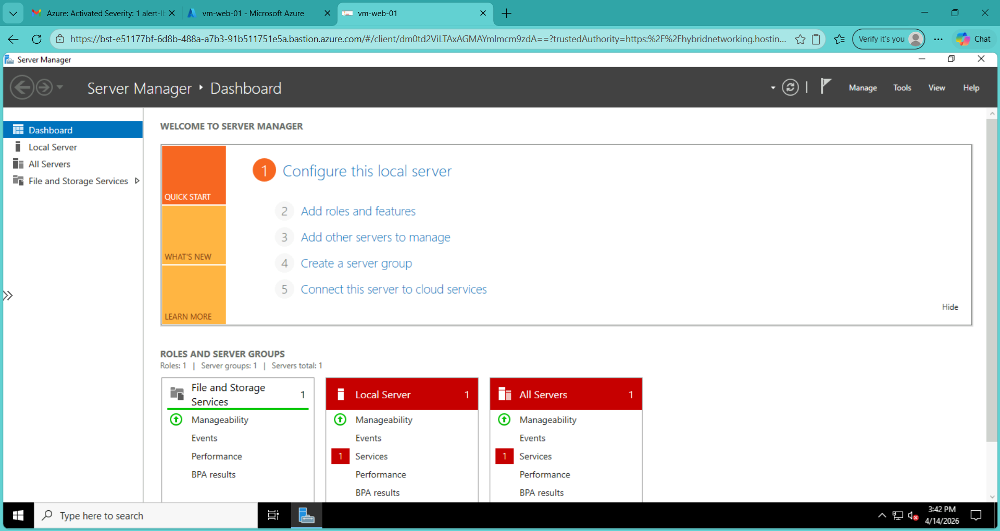
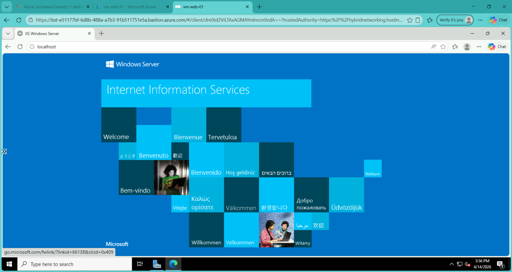
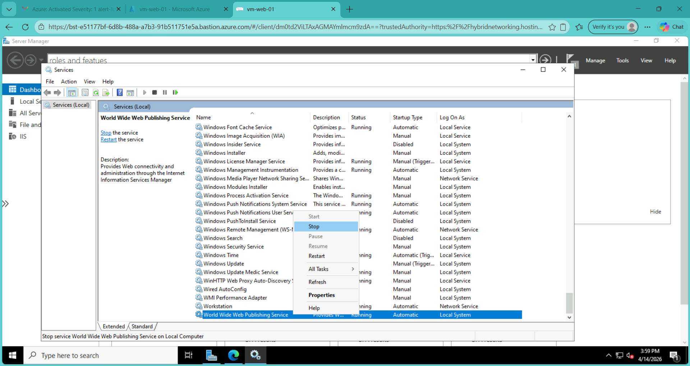
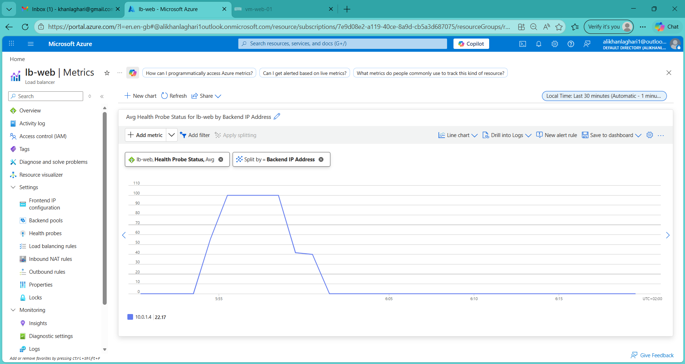
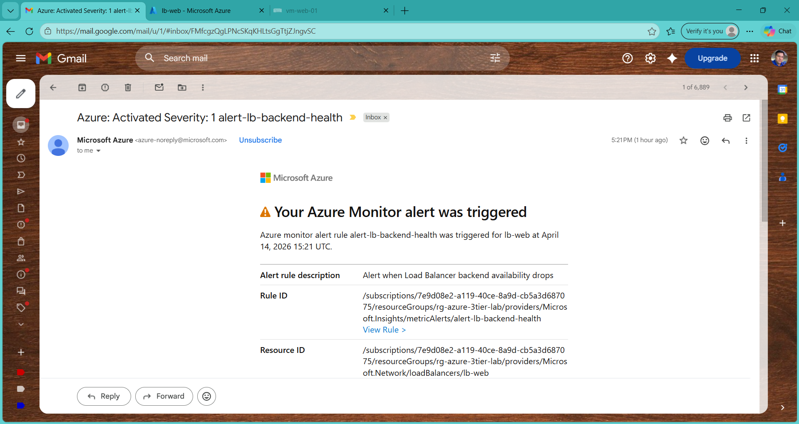
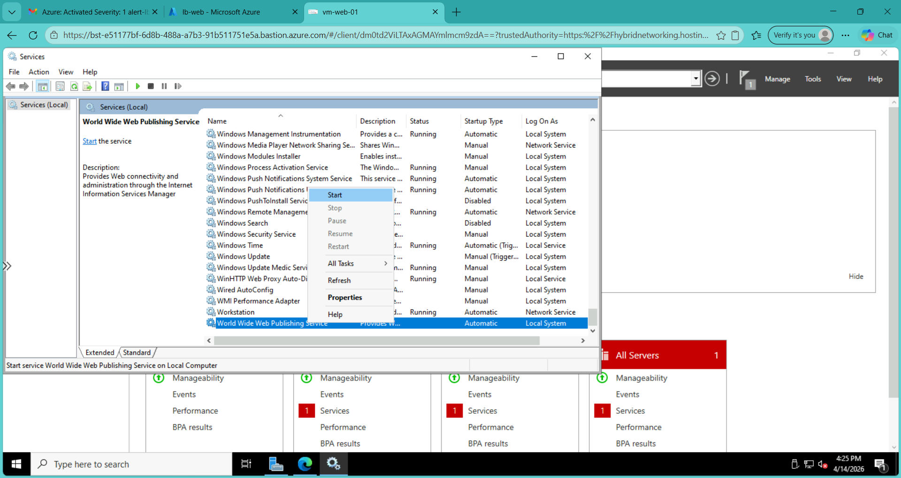
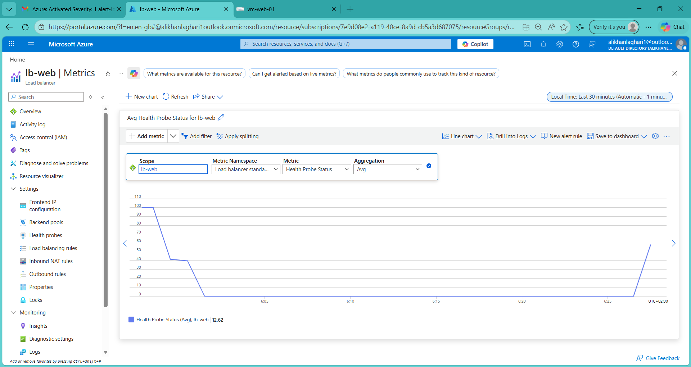

# 🚀 Phase 09B — Load Balancer Backend Health Validation

## 📌 Overview

This phase validates how Azure Load Balancer detects backend health issues at the **application level**, not just VM availability.

A failure scenario was simulated by stopping the web service (IIS) inside the VM and observing:

- Load Balancer health probe failure  
- Backend availability drop  
- Azure Monitor alert triggering  
- Service recovery behavior  

---

## 🎯 Objectives

- Validate Load Balancer health probe behavior  
- Simulate application-level failure (IIS stop)  
- Confirm backend becomes unhealthy  
- Trigger Azure Monitor alert  
- Restore service and confirm recovery  

---

## 🏗️ Architecture Context

- Azure Load Balancer (Standard SKU)  
- Backend pool → Web VM (`vm-web-01`)  
- Health probe → HTTP on port 80 (`/`)  
- Monitoring → Azure Monitor + Alerts  
- Access → Azure Bastion  

---

## ⚙️ Step-by-Step Execution

---

### 🔹 Step 1 — Connect to Web VM via Bastion

Accessed the web VM securely without exposing it publicly.

---

### 🔹 Step 2 — Verify IIS is Running (Baseline)

Confirmed that the web service is healthy before failure simulation.

- Service: **World Wide Web Publishing Service**
- Status: Running

---

### 🔹 Step 3 — Simulate Application Failure

Stopped IIS service inside the VM.

- Action: Stop service  
- Result: Application becomes unavailable on port 80  

---

### 🔹 Step 4 — Load Balancer Detects Unhealthy Backend

Azure Load Balancer health probe fails:

- HTTP probe cannot reach `/` endpoint  
- Backend marked unhealthy internally  

---

### 🔹 Step 5 — Azure Monitor Alert Triggered

Alert fired due to backend availability drop:

- Metric: Load Balancer backend health  
- Condition: Availability < 100%  
- Action: Email notification  

---

### 🔹 Step 6 — Restore Application Service

Restarted IIS service.

- Action: Start service  
- Result: Application becomes reachable again  

---

### 🔹 Step 7 — Backend Health Recovery

Load Balancer detects recovery:

- Health probe succeeds  
- Backend returns to healthy state  
- Traffic routing resumes  

---

## 📊 Key Observations

- Load Balancer health is based on **application response**, not VM state  
- A running VM can still be marked **unhealthy**  
- Health probes provide real-time failure detection  
- Azure Monitor integrates directly with LB metrics  
- Alerts can be triggered without shutting down infrastructure  

---

## 🧠 Key Learnings

- Importance of **application-level monitoring**  
- Difference between:
  - VM availability  
  - Application availability  
- Load balancers protect systems from failed instances  
- Real-world troubleshooting approach:
  - Detect → Alert → Investigate → Recover  

---

## 🚀 Real-World Relevance

This scenario reflects real production environments:

- Web service failure occurs  
- Load balancer removes unhealthy instance  
- Monitoring system alerts engineers  
- Service is restored without full outage  

---

## 🏁 Conclusion

This phase demonstrated:

- Application-level failure simulation  
- Automated detection via Load Balancer  
- Alerting via Azure Monitor  
- Full recovery workflow  

This is a critical capability for maintaining **high availability systems** in enterprise environments.